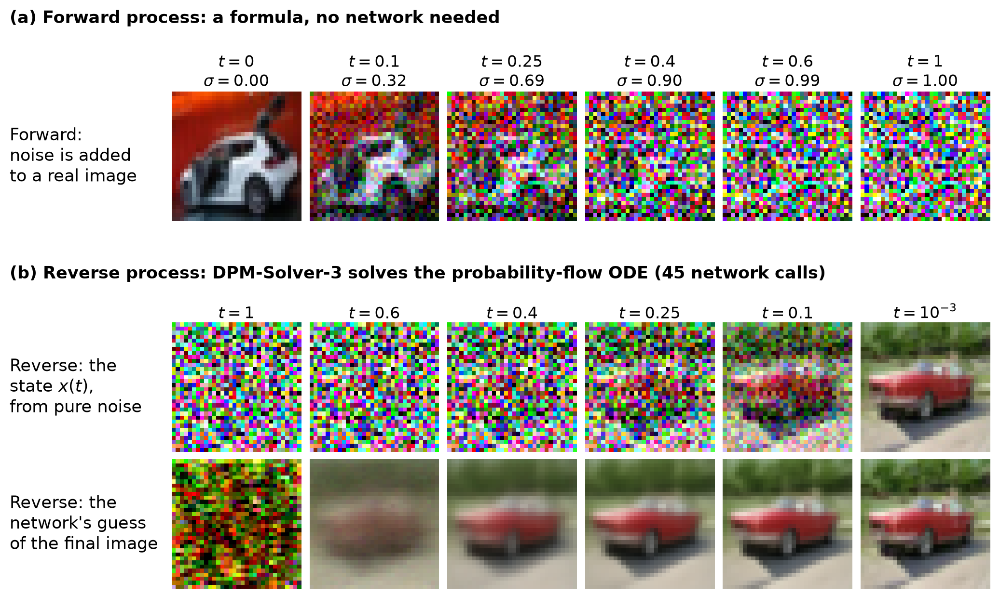
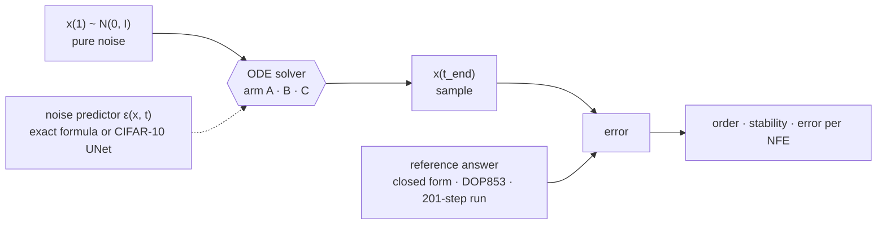
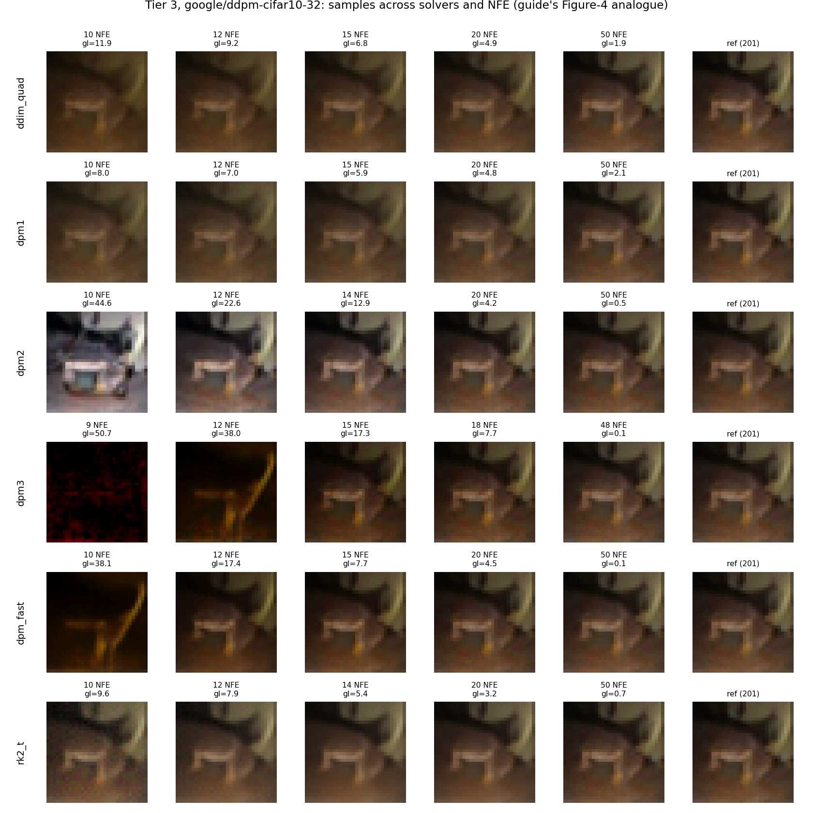

<div align="center">

# A Numerical Analysis of DPM-Solver

**Convergence, stability and cost in fast diffusion sampling**

CSE 402 · Numerical Analysis, Simulation & Modeling · BUET · **Section A, Group 03**

[](report/final/A_03.pdf)
[](https://arxiv.org/abs/2206.00927)


</div>

> [!IMPORTANT]
> **For evaluators:** the submitted report is **[`report/final/A_03.pdf`](report/final/A_03.pdf)**,
> and each member's contribution is listed under **[Team and contributions](#team-and-contributions)**.

## Overview

A diffusion model makes an image by solving an ODE: start from pure noise and
integrate the *probability-flow ODE* back to data, with one call to a large
neural network at every step. DPM-Solver ([Lu et al., NeurIPS 2022](https://arxiv.org/abs/2206.00927))
cut the number of calls from hundreds to 10–20, and its authors judged it by
FID, an image-quality score.

<p align="center">
  
  <br>
  <sub>(a) Training adds noise to real images; (b) generation solves the ODE back from pure noise, here with DPM-Solver-3 in 45 network calls.</sub>
</p>

We judge it the way numerical analysis judges any ODE solver:

- **Order:** does the error shrink at the textbook rate as the step shrinks?
- **Stability:** do large steps blow up near the data end, where the ODE stiffens?
- **Cost:** which solver is most accurate for a fixed number of network calls (NFE)?



## Key findings

| Question | What we measured |
|---|---|
| Is the implementation right? | Our DDIM and DPM-Solver-1 agree to **5.5 × 10⁻¹⁶**. With an exact score and small steps, every solver reaches its textbook order to within **0.094**. |
| Does the order hold at practical budgets? | No. At 10–120 NFE down to t = 10⁻³ no solver is in its asymptotic regime: even with an exact score the order misses theory by up to **1.91**, against **2.79** on the real network. |
| Do explicit solvers blow up near t → 0? | Not on the linear Gaussian, at any condition number up to 10⁸. On the curved mixture, RK4 in t is limited to **h ≤ 0.1998**; stepping in λ removes the limit. |
| What does stepping in λ buy? | RK4's error falls **48×, 8551× and 10.6×** on the three testbeds. For Euler and RK2 the effect is mixed. |
| At equal cost, when does order 3 beat order 1? | From **5.1, 9.2 and 14.1 NFE** on the three testbeds. The last is on the paper's own checkpoint, and reproduces its unexplained Table 6 result (10–12 NFE). |
| When does solving the linear part exactly help? | On concentrated data. On data as spread out as the noise, classical steppers are exact and DPM-Solver is not. |
| Is the best-looking sampler the most accurate? | No. At 10 NFE, FID and distance to the converged image rank the samplers in **exactly opposite order** (rank correlation −1.00). |

<p align="center">
  
  <br>
  <sub>One starting noise, six samplers, five budgets. At 10 NFE, DPM-Solver-2 gives a sharp image of something different from where this noise leads; DPM-Solver-1 gives the right image, blurred.</sub>
</p>

## How the study is built

**Three arms** pull apart the paper's two ideas: a new time variable, and exact treatment of the linear part.

| Arm | Solver | Grid | Comparison |
|---|---|---|---|
| A | Euler, RK2, RK3, RK4, AB2 on the ODE in `t` | uniform in `t` | baseline |
| B | the same steppers on the ODE in `λ` (half log-SNR) | uniform in `λ` | A vs B = the change of variable |
| C | DPM-Solver-1/2/3, the authors' code, unmodified | uniform in `λ` | B vs C = the exact linear part |

**Three testbeds** trade an exact reference answer for realism.

| Tier | Problem | Reference answer | Runs on |
|---|---|---|---|
| 1 | anisotropic Gaussian, condition number κ = 1 to 10⁴ | closed form | laptop CPU |
| 2 | 8 point masses on a Swiss roll (curved score) | SciPy DOP853, rtol 10⁻¹³ | laptop CPU |
| 3 | the paper's CIFAR-10 DDPM network, [`google/ddpm-cifar10-32`](https://huggingface.co/google/ddpm-cifar10-32) | 201-step run of the same network | Kaggle T4 GPU |

Tiers 1 and 2 feed the solvers an exact noise predictor, so every bit of error is the solver's.
All comparisons across solvers are at equal **measured** NFE, not equal step counts.

## Quick start

```bash
git clone https://github.com/MehemudAzad/NUMERICAL-PROJECT.git
cd NUMERICAL-PROJECT
python3 -m venv .venv && source .venv/bin/activate
pip install -r requirements.txt

python -m pytest     # 129 tests, a few seconds
./run_all.sh         # rebuilds every CPU-side figure and results CSV
```

`run_all.sh` runs the tests and then notebooks 01–08, 12 and 10. On a clean clone it reproduces
the committed results to 1.8 × 10⁻¹⁵. Options: `--tests-only`, `--no-install`.

<details>
<summary>macOS: Homebrew Python 3.14 fails to install packages</summary>

Homebrew's `python@3.14` has a broken `pyexpat` on macOS 26, which breaks `pip`. Use
[uv](https://docs.astral.sh/uv/) with Python 3.12 instead:

```bash
uv venv --python 3.12 .venv && source .venv/bin/activate
uv pip install -r requirements.txt
```

</details>

### GPU notebooks (Tier 3)

Notebooks 09, 11 and 11b need a CUDA GPU. Open them on [Kaggle](https://www.kaggle.com/code)
with **Accelerator: GPU T4** and **Internet: on**. Each one clones this repository and installs
its own extras (Diffusers, clean-fid). Their outputs are committed, so everything else runs
without a GPU.

## Notebooks

| Notebook | What it does | Runs on |
|---|---|---|
| [`01_schedule`](notebooks/01_schedule.ipynb) | VP-linear noise schedule and the λ ↔ t map | CPU |
| [`02_tier1_testbed`](notebooks/02_tier1_testbed.ipynb) | Gaussian testbed: exact score and exact trajectory | CPU |
| [`03_solvers`](notebooks/03_solvers.ipynb) | classical steppers (arms A and B) and their orders | CPU |
| [`04_arm_c`](notebooks/04_arm_c.ipynb) | DPM-Solver wrapper; the DDIM ≡ DPM-Solver-1 check | CPU |
| [`05_convergence`](notebooks/05_convergence.ipynb) | measured order of every solver on Tier 1 | CPU |
| [`06_stability`](notebooks/06_stability.ipynb) | largest stable step size across κ | CPU |
| [`07_tier2`](notebooks/07_tier2.ipynb) | mixture testbed, DOP853 reference, order under curvature | CPU |
| [`08_crossover`](notebooks/08_crossover.ipynb) | where order 3 overtakes order 1 at matched step size | CPU |
| [`09_tier3_cifar10`](notebooks/09_tier3_cifar10.ipynb) | every solver on the CIFAR-10 network; error decomposition | Kaggle T4 |
| [`10_report`](notebooks/10_report.ipynb) | reads `results/` and builds every report table and the predictions ledger | CPU |
| [`11_samples_fid`](notebooks/11_samples_fid.ipynb) | sample grid, FID on 5,000 samples, per-image error | Kaggle T4 |
| [`11b_fid_floor`](notebooks/11b_fid_floor.ipynb) | FID of real CIFAR-10 images against sample size | Kaggle |
| [`12_controls`](notebooks/12_controls.ipynb) | controls: both protocols, Tier-2 stability, matched-NFE crossover, when the split helps | CPU |

## Repository layout

```
src/            numerical engine: schedule, testbeds, steppers, integrator, metrics (no GPU, no plotting)
tests/          pytest suite (129 tests)
notebooks/      the experiments above; each writes to results/ and figures/
results/        every measured number, as CSV
figures/        every plot, as PNG
third_party/    the authors' dpm_solver_pytorch.py, unmodified at a pinned commit (MIT)
report/final/   the submitted ACM report, A_03.pdf, and its LaTeX source
report/         a longer technical report, main.pdf
docs/           background: the base paper, the implementation guide, the original proposal
run_all.sh      one-command reproduction of all CPU-side results
```

The most useful results files:

| File | Contents |
|---|---|
| [`master_order_table.csv`](results/master_order_table.csv) | measured order, fit window and R² for every tier, arm and solver |
| [`matched_protocol_slopes.csv`](results/matched_protocol_slopes.csv) | the same orders under the asymptotic and the practitioner protocol |
| [`crossover_matched_nfe.csv`](results/crossover_matched_nfe.csv) | NFE at which DPM-Solver-3 and DPM-Solver-1 cross, per testbed |
| [`reparam_gain.csv`](results/reparam_gain.csv) | error in t divided by error in λ, per tier and solver |
| [`tier3_fid_vs_l2.csv`](results/tier3_fid_vs_l2.csv) | FID next to the paper's FID and the trajectory error, with ranks |
| [`predictions_ledger.csv`](results/predictions_ledger.csv) | each prediction, its verdict and the evidence, computed from the data |

## Report

- **[`report/final/A_03.pdf`](report/final/A_03.pdf)**: the submitted report (ACM `sigconf`, 10 pages).
- [`report/main.pdf`](report/main.pdf): a longer technical version with full derivations.

Every number in both reports is read from `results/`. To rebuild the submitted one:

```bash
cd report/final
latexmk -pdf A_03.tex            # or, without a TeX install: tectonic -X compile A_03.tex
```

## Team and contributions

| Member | Student ID | Main area |
|---|---|---|
| **Mehemud Azad** | 2105014 | project lead and integration; planned all seven experiments; project setup, noise schedule, Gaussian testbed; report writing; FID floor |
| **Sayjad Rahman** | 2105021 | classical solvers, DPM-Solver and DDIM, samples and FID, control experiments |
| **Gourove Roy** | 2105017 | Tier 3 on the real network, shared engine, report tables, reproducibility, reports |
| **Khalid Hasan Tuhin** | 2105002 | selected the project idea; Tier-2 mixture testbed and DOP853 reference (used by every Tier-2 result), Tier-2 convergence, crossover study |
| **Niloy Das Robin** | 2105019 | order fitting, Tier-1 convergence, stability analysis |

Each piece of work was committed by the member who built it; `git shortlog -sn` lists commits per
member (Niloy's commits appear as `BALLISTICrobin`).

<details open>
<summary><b>Mehemud Azad</b> · 2105014</summary>

- **Project lead.** Led the project and orchestrated the team's work: split it across members, set the working rules, and took each piece from plan to results.
- **Integration.** Put the members' parts together and made sure the whole pipeline runs end to end.
- **Experiment design.** Planned all seven experiments: the DDIM ≡ DPM-Solver-1 check, convergence order, stability near t → 0, the order-3 vs order-1 crossover, the λ change of variable, when the exact linear split helps, and FID against trajectory error. The plans are the implementation guide (`docs/cse402_guide.html`) and the post-review correction plan in `docs/`.
- **Project setup:** repository layout, the shared results schema (`src/runlog.py`), test wiring and the vendored DPM-Solver code (`third_party/`).
- The VP-linear noise schedule and the λ ↔ t conversion (`src/schedule.py`, notebook 01).
- The Tier-1 Gaussian testbed with its exact score and closed-form trajectory (`src/testbeds.py`, notebook 02).
- **Report writing.** Rewrote the technical report, `report/main.tex`, after the internal review; most of its current text is this rewrite. Added the controls and FID sections of notebook 10 that feed it. Did the final revision of the submitted report, [`A_03.pdf`](report/final/A_03.pdf): its title, the figure showing how diffusion turns noise into an image, the summary table of the seven experiments, the added figures and the corrections.
- The FID sample-size floor experiment (notebook 11b).
- Presentation slides.

</details>

<details open>
<summary><b>Sayjad Rahman</b> · 2105021</summary>

- The classical solvers (Euler, RK2, RK3, RK4, AB2) and the shared integrator that measures NFE (`src/solvers.py`), plus the λ-uniform grids (`src/grids.py`, notebook 03).
- DPM-Solver-1 and DDIM written by hand, the wrapper around the authors' DPM-Solver code, and the DDIM ≡ DPM-Solver-1 check (`src/dpm.py`, `src/arm_c.py`, notebook 04).
- Generated sample images and FID on Kaggle (`src/imaging.py`, notebook 11).
- The control experiments: both protocols, Tier-2 stability, the matched-NFE crossover and when the exact linear split helps (notebook 12).

</details>

<details open>
<summary><b>Gourove Roy</b> · 2105017</summary>

- **Tier 3 on the real network.** Built `src/tier3.py`, which runs every solver on the CIFAR-10 DDPM network using the checkpoint's own discrete noise schedule, and ran it on a Kaggle T4. [Notebook 09](notebooks/09_tier3_cifar10.ipynb) measures error against NFE for all nine solver and arm combinations, caches the reference runs, measures the reference's own error floor, and splits Tier-3 error into discretisation, `t_end` truncation and that floor (`results/tier3_error.csv`, `results/tier3_decomposition.csv`, `figures/09_*.png`).
- **Shared engine.** Made the integrator work on GPU tensors as well as NumPy arrays (`src/solvers.py`) and let the ODE take a schedule object (`src/testbeds.py`), so the same code runs all three tiers. Tests: `tests/test_tier3.py`.
- **Report tables.** [Notebook 10](notebooks/10_report.ipynb) builds the master order table, the crossover summary, the predictions ledger and the proposal-coverage table directly from the results files. Added the floor-aware order fit to `src/metrics.py`. Tests: `tests/test_report.py`.
- **Reproducibility.** Wrote `run_all.sh` and ran it end to end; the regenerated results matched the committed ones to 1.8 × 10⁻¹⁵.
- **Reports.** The first version of the technical report (`report/main.tex`, later largely rewritten), and the submitted ACM-format report, [`A_03.pdf`](report/final/A_03.pdf), written from its content.

</details>

<details open>
<summary><b>Khalid Hasan Tuhin</b> · 2105002</summary>

- **Project idea.** Selected the project's topic at the start: a numerical analysis of DPM-Solver as an ODE solver.
- **Tier-2 testbed.** Designed and built `MixtureTier2` (`src/testbeds.py`): data on K points, so the score stays exact while the posterior mean becomes a softmax over the modes and the probability-flow ODE turns nonlinear. Built `mog8`, 8 modes on a Swiss-roll curve (`swiss_roll`). Every Tier-2 result in the report runs on it: the order tables, the curved-problem stability limit, the λ change of variable and the crossover.
- **Reference solution.** `dop853_reference`, a batched SciPy DOP853 integration at rtol 10⁻¹³ that stands in for the closed-form trajectory Tier 2 does not have, with a convergence check against a rerun at a tighter tolerance.
- **Tier-2 convergence experiment.** Measured every solver's order on the curved testbed with the same sweep as Tier 1, so any change in order comes from curvature (notebook 07, `results/tier2_order.csv`).
- **Crossover study.** The crossing finder in `src/crossover.py`, which interpolates both error curves in log-log space and reports every sign change; the matched-NFE crossover in notebook 12 reuses it. The equal-step-size crossover (notebook 08, `results/crossover_sweep.csv`), which found the crossing flat at 4.4 to 5.0 NFE across five decades of κ on Tier 1 and at 8.9 NFE on Tier 2.
- **Tests.** `tests/test_tier2.py` and `tests/test_crossover.py` (20 tests).

</details>

<details open>
<summary><b>Niloy Das Robin</b> · 2105019</summary>

- The sliding-window order fitter (`src/metrics.py`) and the Tier-1 convergence experiment (notebook 05).
- The bisection test for the largest stable step size and the κ-sweep stability envelope (`src/stability.py`, notebook 06).

</details>

## Acknowledgements

- DPM-Solver by Cheng Lu et al.: [`LuChengTHU/dpm-solver`](https://github.com/LuChengTHU/dpm-solver), vendored unmodified under its MIT licence ([`third_party/LICENSE-dpm-solver`](third_party/LICENSE-dpm-solver)).
- The CIFAR-10 DDPM checkpoint [`google/ddpm-cifar10-32`](https://huggingface.co/google/ddpm-cifar10-32) (Ho et al., 2020), loaded with [Diffusers](https://github.com/huggingface/diffusers).
- FID computed with [clean-fid](https://github.com/GaParmar/clean-fid); GPU time from [Kaggle](https://www.kaggle.com/).

```bibtex
@inproceedings{lu2022dpmsolver,
  title     = {{DPM-Solver}: A Fast {ODE} Solver for Diffusion Probabilistic Model Sampling in Around 10 Steps},
  author    = {Lu, Cheng and Zhou, Yuhao and Bao, Fan and Chen, Jianfei and Li, Chongxuan and Zhu, Jun},
  booktitle = {Advances in Neural Information Processing Systems},
  volume    = {35},
  pages     = {5775--5787},
  year      = {2022}
}
```
